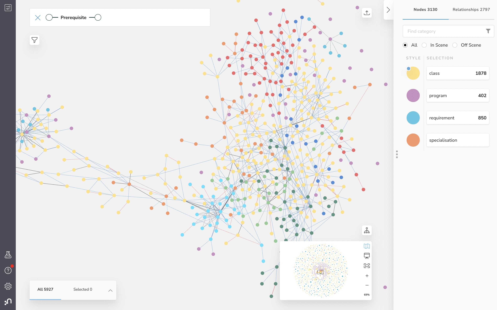
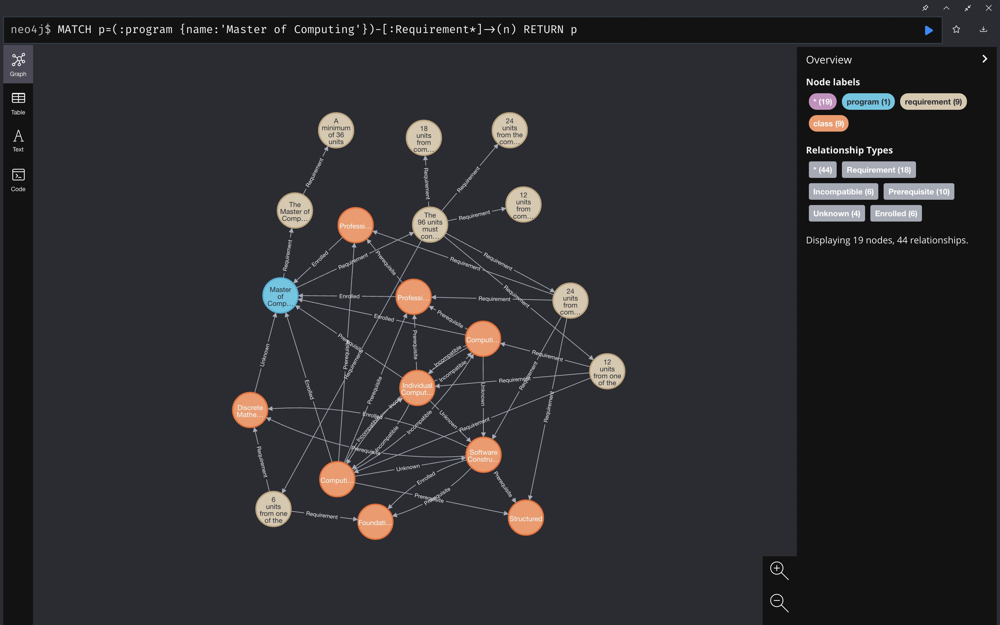

# Changelog
- scrapers prototype completed (stage 1). It still misses / misinterprets text, but can parse things correctly in most cases.

### Tasks
- On Hold
  - [ ] add `CLASS_NAME` to NER pipeline?
- Fix data
  - `ACST4031and`
- [x] Get JSON datasets through ANU API endpoints
- Scrape [ANU Programs and Courses](https://programsandcourses.anu.edu.au/) for additional data
  - Programs:
    - [ ] capture specialisations / majors / minors w.r.t. the degree program
  - concentrations / majors / minors
  - classes
    - [ ] fill in missing ids in program requirements (i.e. specialization, Master of xx as a requirement)
    - [ ] tag PGRD/UGRD and get more class info - co-taught, course convenor
    - [ ] clean up description for classes
    - [ ] add subject area (COMP, MATH, etc)

Items that are formatted very differently

This is a list of programs that are formatted too differently from the others.
As such, generalizing the scraper / parser to format these items could cause incorrectly parsed requirements.
- Bachelor of Arts (Honours)
- Bachelor of Accounting
- Bachelor of Advanced Computing (Honours)
- Bachelor of Asia-Pacific Affairs
- Bachelor of Asian Studies

### Stage 1: Build dataset

#### ANU search API Endpoints
First, retrieve datasets through ANU API.

```sh
curl --request GET -H "Accept: application/json" <url> > data/from_api/output.json 

# Class search
https://programsandcourses.anu.edu.au/data/CourseSearch/GetCourses\?AppliedFilter\=FilterByCourses\&Source\=\&ShowAll\=true\&PageIndex\=\&MaxPageSize\=\&PageSize\=Infinity\&SortColumn\=\&SortDirection\=\&InitailSearchRequestedFromExternalPage\=false\&SearchText\=\&SelectedYear\=2020\&Careers%5B0%5D\=\&Careers%5B1%5D\=\&Careers%5B2%5D\=\&Careers%5B3%5D\=\&Sessions%5B0%5D\=\&Sessions%5B1%5D\=\&Sessions%5B2%5D\=\&Sessions%5B3%5D\=\&Sessions%5B4%5D\=\&Sessions%5B5%5D\=\&DegreeIdentifiers%5B0%5D\=\&DegreeIdentifiers%5B1%5D\=\&DegreeIdentifiers%5B2%5D\=\&FilterByMajors\=\&FilterByMinors\=\&FilterBySpecialisations\=\&CollegeName\=\&ModeOfDelivery\=All+Modes

# Program search
https://programsandcourses.anu.edu.au/data/ProgramSearch/GetProgramsUnderGraduate?AppliedFilter=FilterByPrograms&Source=&ShowAll=True&PageIndex=0&MaxPageSize=10&PageSize=Infinity&SortColumn=&SortDirection=&InitailSearchRequestedFromExternalPage=false&SearchText=&SelectedYear=2022&Careers%5B0%5D=&Careers%5B1%5D=&Careers%5B2%5D=&Careers%5B3%5D=&Sessions%5B0%5D=&Sessions%5B1%5D=&Sessions%5B2%5D=&Sessions%5B3%5D=&Sessions%5B4%5D=&Sessions%5B5%5D=&DegreeIdentifiers%5B0%5D=&DegreeIdentifiers%5B1%5D=&DegreeIdentifiers%5B2%5D=&FilterByMajors=&FilterByMinors=&FilterBySpecialisations=&CollegeName=All+Colleges&ModeOfDelivery=All+Modes
https://programsandcourses.anu.edu.au/data/ProgramSearch/GetProgramsPostGraduate?AppliedFilter=FilterByPrograms&Source=&ShowAll=True&PageIndex=0&MaxPageSize=10&PageSize=Infinity&SortColumn=&SortDirection=&InitailSearchRequestedFromExternalPage=false&SearchText=&SelectedYear=2022&Careers%5B0%5D=&Careers%5B1%5D=&Careers%5B2%5D=&Careers%5B3%5D=&Sessions%5B0%5D=&Sessions%5B1%5D=&Sessions%5B2%5D=&Sessions%5B3%5D=&Sessions%5B4%5D=&Sessions%5B5%5D=&DegreeIdentifiers%5B0%5D=&DegreeIdentifiers%5B1%5D=&DegreeIdentifiers%5B2%5D=&FilterByMajors=&FilterByMinors=&FilterBySpecialisations=&CollegeName=All+Colleges&ModeOfDelivery=All+Modes

# Specializations / Majors / Minors
https://programsandcourses.anu.edu.au/data/SpecialisationSearch/GetSpecialisations?AppliedFilter=FilterByAllSpecializations&Source=&ShowAll=True&PageIndex=0&MaxPageSize=10&PageSize=Infinity&SortColumn=&SortDirection=&InitailSearchRequestedFromExternalPage=false&SearchText=&SelectedYear=2022&Careers%5B0%5D=&Careers%5B1%5D=&Careers%5B2%5D=&Careers%5B3%5D=&Sessions%5B0%5D=&Sessions%5B1%5D=&Sessions%5B2%5D=&Sessions%5B3%5D=&Sessions%5B4%5D=&Sessions%5B5%5D=&DegreeIdentifiers%5B0%5D=&DegreeIdentifiers%5B1%5D=&DegreeIdentifiers%5B2%5D=&FilterByMajors=&FilterByMinors=&FilterBySpecialisations=&CollegeName=All+Colleges&ModeOfDelivery=All+Modes
https://programsandcourses.anu.edu.au/data/MinorSearch/GetMinors?AppliedFilter=FilterByAllSpecializations&Source=&ShowAll=True&PageIndex=0&MaxPageSize=10&PageSize=Infinity&SortColumn=&SortDirection=&InitailSearchRequestedFromExternalPage=false&SearchText=&SelectedYear=2022&Careers%5B0%5D=&Careers%5B1%5D=&Careers%5B2%5D=&Careers%5B3%5D=&Sessions%5B0%5D=&Sessions%5B1%5D=&Sessions%5B2%5D=&Sessions%5B3%5D=&Sessions%5B4%5D=&Sessions%5B5%5D=&DegreeIdentifiers%5B0%5D=&DegreeIdentifiers%5B1%5D=&DegreeIdentifiers%5B2%5D=&FilterByMajors=&FilterByMinors=&FilterBySpecialisations=&CollegeName=All+Colleges&ModeOfDelivery=All+Modes
https://programsandcourses.anu.edu.au/data/MajorSearch/GetMajors?AppliedFilter=FilterByAllSpecializations&Source=&ShowAll=True&PageIndex=0&MaxPageSize=10&PageSize=Infinity&SortColumn=&SortDirection=&InitailSearchRequestedFromExternalPage=false&SearchText=&SelectedYear=2022&Careers%5B0%5D=&Careers%5B1%5D=&Careers%5B2%5D=&Careers%5B3%5D=&Sessions%5B0%5D=&Sessions%5B1%5D=&Sessions%5B2%5D=&Sessions%5B3%5D=&Sessions%5B4%5D=&Sessions%5B5%5D=&DegreeIdentifiers%5B0%5D=&DegreeIdentifiers%5B1%5D=&DegreeIdentifiers%5B2%5D=&FilterByMajors=&FilterByMinors=&FilterBySpecialisations=&CollegeName=All+Colleges&ModeOfDelivery=All+Modes
```

#### Scrape programsandcourses website
Run `./run_spiders.sh` to create / update dataset.

Snippets
```sh
# run spider and save output to data.json, print errors to console
scrapy runspider crawler/spider_program.py -O data.json --loglevel=ERROR

# prettify json
cat data.json | python -m json.tool > pretty.json

# get frequency of conditions
grep "condition" data/scraped/classes.json | awk -F" " '{print $2}' | sort | uniq -c | sort -nr

  # output
  #  56 "completed",
  #  38 "incompatible", -> Class
  #  36 "studying", -> Program
  #  18 "enrolled", -> Program, Class
  #  14 "Unknown",
  #  5 "permission",
  #  1 "obtained",
```

#### Semantic Parsing

```sh

# target: "and" / "or" where
# a. preceded or followed by a punctuation, unless that punctuation is part of a named entity
# b. different pair of named entity and verb on left and right of the sentence
# give priority to a over b
# action: split
"To enrol in this course you must be studying a Master of Engineering 
and 
have completed ENGN8100 and (ENGN8160 or ENGN8260)."

"To enrol in this course you must have either: completed COMP6250 (Professional Practice 1) 
and be enrolled in the Master of Computing; 
OR 
be enrolled in the Master of Computing (Advanced)."

# capture co-requisite (COMP6710 OR COMP6730)
# target: "or" & if verb to the left but no named entity to the left
# action: treat as one expression, co-requisite check
# turn it into OR of two expressions: enrolled, completed
"To enrol in this course you must have completed or be currently enrolled in COMP6710 OR COMP6730."

# split by "-" and check length
# note verb to the left of ":" and recursively divide the right half into left and right
"To enrol in this course you must: 
- be enrolled in the Master of Computing 
- have completed COMP8260 and COMP6442 
- find a project/supervisor; and 
- have an approved 'Independent Study Contract' Incompatible with COMP8715 and COMP8830."
```
### Stage 2: Build Neo4j Graph Database; create and expose GraphQL endpoint
#### Neo4j (in progress)



#### GraphQL
- Apollo

### Stage 3: WebApp


