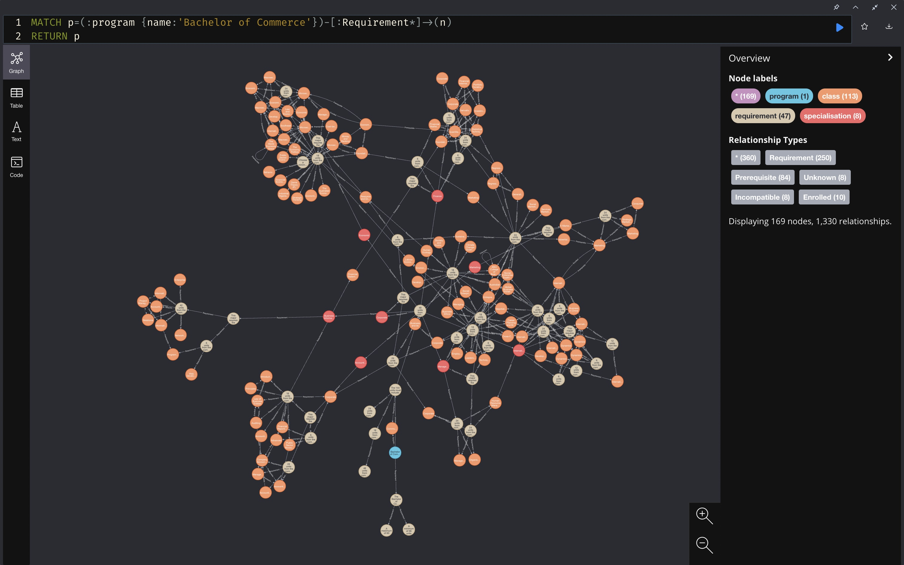
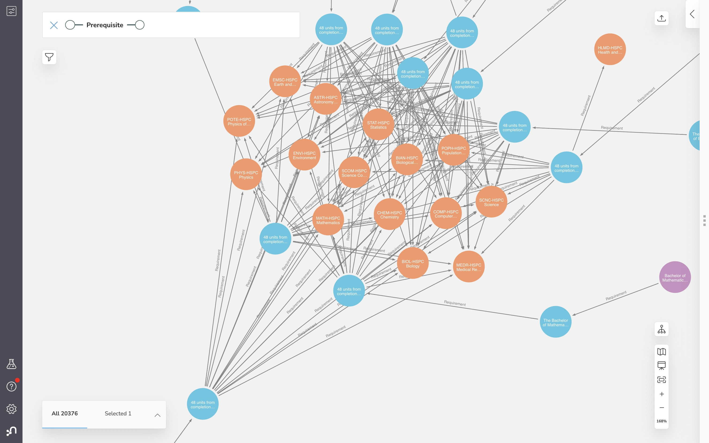
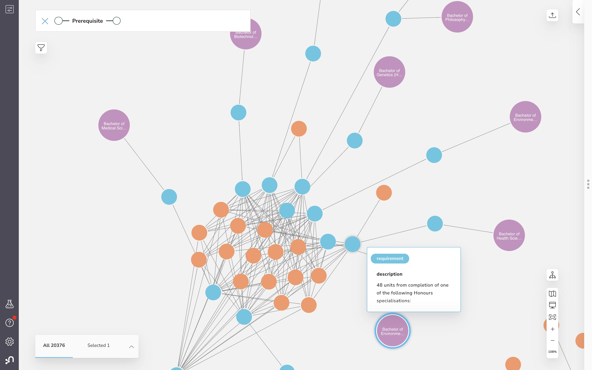

### Stage 1: Build dataset

#### ANU search API Endpoints

1. First, retrieve datasets through ANU API.
    ```./fetch_data.sh```

2. Scrape programsandcourses website.

    The program uses Scrapy to collect data on classes, specialisations, and programs from the ANU programs and courses [website](https://programsandcourses.anu.edu.au/).

    ```./run_spiders.sh```

#### Semantic Parsing

```sh

# target: "and" / "or" where
# a. preceded or followed by a punctuation, unless that punctuation is part of a named entity
# b. different pair of named entity and verb on left and right of the sentence
# give priority to a over b
# action: split
"To enrol in this course you must be studying a Master of Engineering 
and 
have completed ENGN8100 and (ENGN8160 or ENGN8260)."

"To enrol in this course you must have either: completed COMP6250 (Professional Practice 1) 
and be enrolled in the Master of Computing; 
OR 
be enrolled in the Master of Computing (Advanced)."

# capture co-requisite (COMP6710 OR COMP6730)
# target: "or" & if verb to the left but no named entity to the left
# action: treat as one expression, co-requisite check
# turn it into OR of two expressions: enrolled, completed
"To enrol in this course you must have completed or be currently enrolled in COMP6710 OR COMP6730."

# split by "-" and check length
# note verb to the left of ":" and recursively divide the right half into left and right
"To enrol in this course you must: 
- be enrolled in the Master of Computing 
- have completed COMP8260 and COMP6442 
- find a project/supervisor; and 
- have an approved 'Independent Study Contract' Incompatible with COMP8715 and COMP8830."
```
### Stage 2: Build Neo4j Graph Database; create and expose GraphQL endpoint
#### Neo4j

Build neo4j database:

    ```python graph_builder/graph_builder.py```






#### GraphQL

In progress

### Stage 3: WebApp


